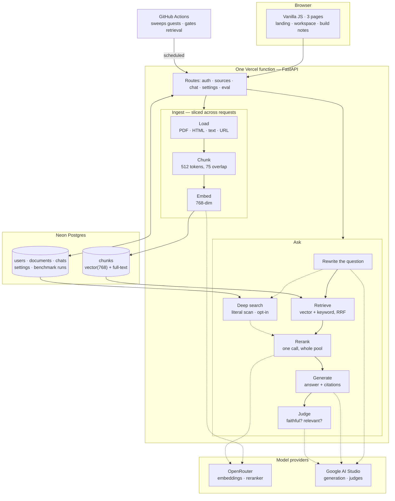

# RAG-it

Ask questions about your own documents and get answers that cite the exact
passage behind them. Upload PDFs, notes or reports; every claim points at the
text it came from, so checking it takes one click.

**Live:** [rag-gel.vercel.app](https://rag-gel.vercel.app) ·
[how it was built](https://rag-gel.vercel.app/built) ·
[health](https://rag-gel.vercel.app/api/health)

No sign-up needed — you get a private workspace immediately, and signing in
later brings your work with you.

---

## The stack

| Layer | Choice | What it does |
|---|---|---|
| **Frontend** | Vanilla JS + Vite, 3 pages | Landing (`/`), workspace (`/app`), build write-up (`/built`). No framework, no runtime dependencies. |
| **Backend** | FastAPI, one Vercel function | Every route in a single serverless function. 60s ceiling, frozen the instant it responds. |
| **Hosting** | Vercel, pinned to `sin1` | The function runs in the same region as the database. Across the Pacific a round trip cost 420ms; alongside it, 3ms. |
| **App database** | Neon Postgres + SQLAlchemy | Users, documents, chats, messages, saved settings, benchmark runs. |
| **Vector store** | pgvector in the same Neon database | One fixed `vector(768)` column shared by every model. Chroma swaps in for local dev behind one dispatch module. |
| **Chunking** | Recursive splitter, 512 tokens, 75 overlap | Splits on paragraph → sentence → word. Size is in **tokens**, not characters. |
| **Embeddings** | `perplexity/pplx-embed-v1-0.6b` (OpenRouter), 768-dim | Turns chunks and questions into vectors. Chosen on measurement: a third of the cost of the 8B model it replaced, half the latency, and a far flatter tail — 0.62s worst case against 5.67s — for about 3 points of raw retrieval. |
| **Question rewrite** | Generation model | Restates the question before searching, so "and the second one?" still retrieves. Reasoning traces are stripped first. |
| **Retrieval** | Vector + keyword, fused by RRF (k=60) | Two searches at once. Postgres full-text on Neon, in-process BM25 on Chroma. Always on — not a setting. |
| **Reranker** | Cohere `rerank-v3.5` (OpenRouter) | **One** call re-orders the whole candidate pool against the question. Not one call per passage. |
| **Deep search** | Literal scan of stored document text | Reads every document word for word and returns every literal match. Per-question, never a saved setting. |
| **Web search** | Tavily | **Off unless you turn it on.** The last rung of the escalation ladder: reached only after your documents have been searched by ranking *and* word for word. Web passages are labelled in the answer and badged in the citation. Signed-in accounts only. |
| **Tool router** | `models/gemini-3.5-flash-lite` (Google AI Studio) | Picks *which* tool to reach for when the app is about to refuse. A separate model on purpose: the answering model accepts a `tools` parameter and then never emits a call, verified live. ~0.7s, and nothing it produces is ever shown. |
| **Generation** | `models/gemma-4-26b-a4b-it` (Google AI Studio) | Writes the answer from the retrieved passages, with inline citations. Kept over `gemini-3.5-flash-lite`, which scored 6.5 points lower on the golden set for no speed gain. |
| **Judges** | `models/gemini-3.5-flash-lite`, LLM-as-judge | A separate model on purpose: grading wants a terse verdict, and the writer is a thinking model whose trace bills against the token budget. Scores each answer for faithfulness and relevancy in a **second request** — grading costs more than answering, and you should not wait for it. A judge that fails reports `ungraded`, never `failed`. |
| **Evaluation** | 56 golden questions over 27 documents | The scored result **ships with the app** — nobody runs a benchmark to see it. |
| **CI gate** | GitHub Actions on push to main | Fails the build if retrieval regresses against a committed baseline. Passes loudly when a provider is down. |
| **Auth** | Google OAuth + password fallback | Signed HTTP-only session cookie, plus a non-secret cookie so the page can paint identity before the server replies. |
| **Guest workspaces** | Throwaway, 30-minute idle limit | Private per visitor. A scheduled job sweeps expired ones every 5 minutes — which also keeps Neon from suspending, worth 9s off a cold visitor's first load. |

---

## Architecture



**The constraint that shapes it:** the function is frozen the instant it sends
a response and has 60 seconds to work in. So long jobs are sliced across
requests, nothing periodic runs inside the app, and every durable byte goes to
Postgres. The [build write-up](https://rag-gel.vercel.app/built) covers why in
full.

---

## What each part does

**Retrieval is two searches, not one.** Vector search finds meaning; keyword
search finds exact strings. Their rankings are fused, so an invoice number and
a paraphrased policy are both findable. It is unconditional — there is no
switch, because there is no trade worth offering.

**The app reaches for its own tools, and a model picks which.** When ranked
search comes up short — or the model reads the passages and says the answer is
not there — it does not simply refuse. It reads every document you own word for
word, and tells you it did, under the answer. Which tool it reaches for is a
judgement, not a rule: "this should be in their documents, the ranker missed
it" and "this could never have been in a private file" want different answers,
and only a model can tell them apart. It can improve the choice; it can never
block one, and the happy path never pays for it.

**It does not go outside unless you let it.** Web search ships off: answers come
from your documents, and an app that quietly searched the web whenever your
documents fell short would be grounded only most of the time. Turn it on and the
web becomes a last resort — after ranking, after the word-for-word read — with
everything it finds labelled as a web source, and your own documents winning any
disagreement.

**Evaluation ships, it does not run.** 56 questions with known answers over 27
documents, including questions the corpus deliberately cannot answer. The
result is committed to the repo and rendered on first paint. Each answer you
get is then drawn on the same bars, so "is this one normal?" is a glance. And a
question the bank knows — the golden set, or the eight pairs over the sample
documents a first visit starts on — is measured, not described: its rows show
where the passage that actually answers it ranked.

**Grading fails open.** A judge that times out is a broken grader, not a bad
answer, so it reports `ungraded`. Rendering that as a failure would be a
confident false claim about your documents.

**The ruler is calibrated per embedding model.** The cosine retrieval metrics
decide "does this chunk contain the golden passage?" against a threshold, and
that threshold belongs to the embedder, not to the harness — models put their
similarities on different scales. Scored with the wrong one, a perfectly good
embedder reads as catastrophic. `eval/calibrate.py` derives it from labelled
pairs; `eval/thresholds.json` stores it per model with its error rates.

---

## Run it locally

```bash
# Backend (port 8000)
.venv/Scripts/python -m uvicorn ragchat.app:app --reload --port 8000

# Frontend (port 5173, proxies /api to the backend)
cd frontend && npm install && npm run dev
```

In dev the pages are at `/`, `/app.html` and `/built.html` — the clean `/app`
and `/built` paths are Vercel rewrites and do not exist on the Vite server.

```bash
# Tests — no network, ~21s
.venv/Scripts/python -m pytest tests/ -q

# Screenshots: 3 pages x 5 breakpoints x 2 themes. Fails on overflow,
# page errors, or a grid left with one item under a full row.
node shot.mjs http://localhost:5173

# Workspace layout behaviour a screenshot cannot see
node layout_check.mjs http://localhost:5173

# Benchmark: retrieval only (free), or the full run (spends model calls)
.venv/Scripts/python -m eval.run_eval --retrieval-only
.venv/Scripts/python -m eval.run_eval
.venv/Scripts/python -m eval.published --from-run latest   # publish it

# Score a different embedding model without touching config.yaml
.venv/Scripts/python -m eval.run_eval --retrieval-only --embedding-model <model>

# ...and derive ITS match threshold first, or the comparison is a fiction.
# The threshold belongs to the embedder: scored with another model's, a good
# one reads as catastrophic.
.venv/Scripts/python -m eval.calibrate --model <model> --write
```

### Configuration

Pipeline knobs live in `config.yaml` and can be tuned live from Settings.

> **Saving Settings writes one row that replaces `config.yaml` entirely, for
> the whole deployment.** `GET /api/health` reports the *effective* config and
> which keys a save is pinning. **Settings → Reset to shipped defaults** puts
> the file back in charge.

Changing chunking or the embedding model changes a config *fingerprint* that
tags every stored chunk, so existing chunks stop matching and the UI prompts to
re-index. Regenerate the sample-corpus vectors too — `python -m
ragchat.demo_vectors` — or a guest's first question finds nothing.

### Environment

Required: `GEMINI_API_KEY`, `OPENROUTER_API_KEY`, `DATABASE_URL` (or
`PG_DATABASE_URL`), `SESSION_SECRET`, `VECTOR_BACKEND=neon`.

Optional: `GOOGLE_CLIENT_ID` / `GOOGLE_CLIENT_SECRET` for OAuth,
`GUEST_SWEEP_SECRET` to arm the guest sweeper (unset disables the endpoint
rather than opening it). Deployment and OAuth setup live in `IDEA.md` §13–§14.

---

## Project layout

```
api/index.py         Vercel entrypoint — re-exports the FastAPI app
ragchat/
  app.py             routes: auth, sources, chats, settings, eval, admin
  auth.py            Google OAuth + password fallback, signed cookie sessions
  config.py          env settings, config.yaml, DB override, fingerprint
  chunking.py        splitters
  loaders.py         PDF / HTML / text extraction, URL fetch
  embeddings.py      provider-aware embedding + rerank clients
  pipeline.py        ingest, and ask: rewrite → retrieve → rerank → generate
  deepsearch.py      literal scan over stored document text
  websearch.py       web search (Tavily), the last rung of the escalation
  router.py          picks WHICH tool — a different model from the one that writes
  presets.py         the named Settings configurations
  vectordb.py        dispatch to the Chroma or pgvector implementation
  store.py           Chroma (local dev)
  store_neon.py      pgvector (deployed)
  guests.py          throwaway workspaces, seeding, expiry
  demo_vectors.py    precomputed sample-corpus vectors, so seeding costs nothing
  db.py              SQLAlchemy models + engine
eval/
  corpus/            27 synthetic documents
  golden_set.jsonl   56 questions with known answers
  build_golden_set.py generates it, and proves every passage is verbatim
  demo_golden.jsonl  8 more, over the two demo documents a first visit starts on
  golden.py          matches a live chat question against both banks, so the
                     scorecard's ranking rows measure instead of describe
  run_eval.py        the harness
  judges.py          LLM-as-judge
  metrics.py         retrieval metrics, cosine and exact
  baseline.py        the committed baseline the CI gate compares against
  gate.py            CI entry point
  published.py       the shipped benchmark result
  calibrate.py       derives the cosine match threshold for an embedding model
  thresholds.json    that threshold per model, with its measured error rates
  compare.py         diff two runs metric by metric
  check_metrics.py   proves the metrics react to retrieval quality (not pytest)
frontend/
  index.html         landing        →  /
  app.html           workspace      →  /app
  built.html         build write-up →  /built
  app.js, styles.css, landing.css, tokens.css
tests/               361 tests, no network, ~21s
shot.mjs             screenshots: 3 pages x 5 breakpoints x 2 themes
layout_check.mjs     workspace layout behaviour a screenshot cannot see
package.json         playwright, for those two checks only — not the app
.github/workflows/   retrieval gate (push) · guest sweeper (every 5 min)
config.yaml          pipeline knobs
```

---

## Notes for contributors

`CLAUDE.md` carries the non-obvious constraints — the serverless freeze, config
precedence, the 768-dimension invariant, and why evaluation must fail open.
Read it before changing retrieval or config handling; most of it exists because
something broke.
