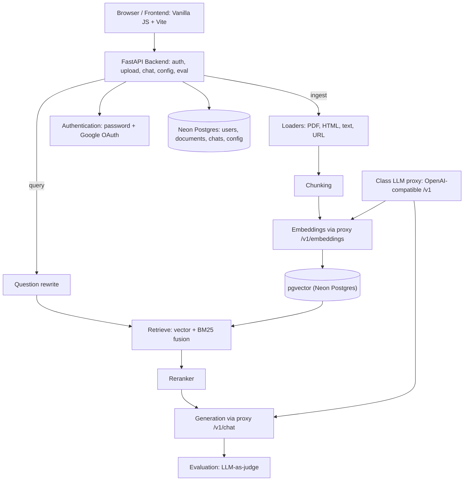

# RAG-it

A multi-user **Retrieval-Augmented Generation (RAG)** web app: chat with an LLM that answers **only from your own documents** (PDFs, web pages, Markdown/text) with citations, a tunable pipeline, and built-in evaluation.

Deployed on **Vercel** (Python backend) with a **Neon Postgres + pgvector** database. Models are served through the class LLM proxy (OpenAI-compatible `/v1` API).

## Architecture



**Component notes**

- **Frontend** — Vanilla JS + Vite 3-pane UI (sources / chat / excerpt). No framework overhead; easy to maintain.
- **Backend** — FastAPI (Python) on Vercel's uv runtime. Lightweight async REST API.
- **Database** — Neon Postgres. Serverless; survives Vercel's read-only filesystem and redeploys.
- **Vector DB** — pgvector inside Neon. One store, no separate vector service to run.
- **Embeddings** — class proxy `/v1/embeddings` (`models/gemini-embedding-001`, 768-dim). One embedding model per deployment; OpenAI-compatible.
- **Generation** — class proxy `/v1/chat/completions` (`models/gemma-4-26b-a4b-it`). Grounds every answer in retrieved passages.
- **Question rewrite** — LLM turns follow-ups ("and what about X?") into standalone queries; improves retrieval for conversational context.
- **Reranker** — LLM cross-encoder re-scores candidates; raises top-k quality, can be toggled off.
- **Evaluation** — LLM-as-judge scores every answer; surfaced as a grey line under each reply.
- **Authentication** — Local username/password + optional Google OAuth. Works out of the box; OAuth is opt-in.

> Web fallback and the reranker are basic first versions that can be improved.

## Evaluation metrics

Each answer shows a grey performance line. These are **heuristic signals, not hard pass/fail** — read them as a tuning aid, not ground truth:

- **Top similarity** — how close the best retrieved chunk is to your question (higher = a more on-topic source was found).
- **Faithfulness** — whether the answer sticks to what the sources say, rather than guessing or adding outside info.
- **Relevancy** — whether the answer actually addresses the question you asked.
- **Latency** — total round-trip time for the answer, in milliseconds.

## Pipeline configuration

All knobs live in `config.yaml` (or are tuned live from the Settings panel, which persists to the database). Changing chunking or embedding settings invalidates stored chunks (a config *fingerprint* tags them), so click **Re-index all** afterward.

- **`chunking`** — `chunk_size`, `chunk_overlap`, `splitter` (recursive | markdown_header | semantic). Controls how documents are split.
- **`embedding.model`** — embedding model spec. Switching models isolates old chunks (different vector dimension) until you re-index.
- **`retrieval.hybrid_search`** — **real BM25 keyword fusion**: vector top-k and a BM25 keyword top-k are fused (RRF). Surfaces exact terms (IDs, codes, names) pure-vector search misses. **Not web search** — your documents only.
- **`retrieval.similarity_threshold`** — minimum cosine similarity a chunk needs to be used. Below it → explicit "not found" answer.
- **`retrieval.top_k` / `candidate_k`** — chunks shown to the LLM / the wider pool the reranker narrows.
- **`retrieval.reranker`** — LLM cross-encoder re-scores candidates → top_k.
- **`generation.web_augmentation`** — **fallback only**, default OFF. Appends labeled `[web]` chunks (DuckDuckGo) **only** when your documents don't clear the relevance threshold. Never overrides a grounded answer.
- **`generation.llm_model` / `temperature`** — answering model + temperature.
- **Secrets (env vars only)** — `GEMINI_API_KEY` (proxy), `RAG_LLM_MODEL` / `RAG_EMBEDDING_MODEL` overrides.

## Run locally

```bash
# Backend (port 8000)
.venv/Scripts/python -m uvicorn ragchat.app:app --host 0.0.0.0 --port 8000

# Frontend (port 5173, proxies /api to the backend)
cd frontend && npm install && npm run dev
```

Set `GEMINI_API_KEY` (and optionally `GOOGLE_CLIENT_ID` / `GOOGLE_CLIENT_SECRET` for OAuth) before starting the backend. In production the app uses Neon (`rag_gel_DATABASE_URL`) and a `/tmp` data dir — no local database needed.

## Project layout

```
ragchat/          FastAPI backend
  app.py          routes: auth, sources, chats, eval, config
  auth.py         Google OAuth + password fallback, signed cookie sessions
  config.py       env settings + config.yaml loader + DB-backed override + fingerprint
  chunking.py     splitters per config
  loaders.py      PDF/HTML/text extraction, URL fetch
  store_neon.py   Neon pgvector chunks + documents
  vectordb.py     vector store dispatcher (Neon impl)
  pipeline.py     ingest + retrieve + rewrite + rerank + generate + eval
  db.py           SQLAlchemy models + Neon engine (users, documents, conversations, messages, config_overrides)
  embeddings.py   ProxyEmbeddings via /v1/embeddings + retry/backoff
frontend/         vanilla JS + Vite (3-pane UI)
eval/             golden set, corpus, judges, metrics, run_eval.py
config.yaml       all pipeline knobs
```
